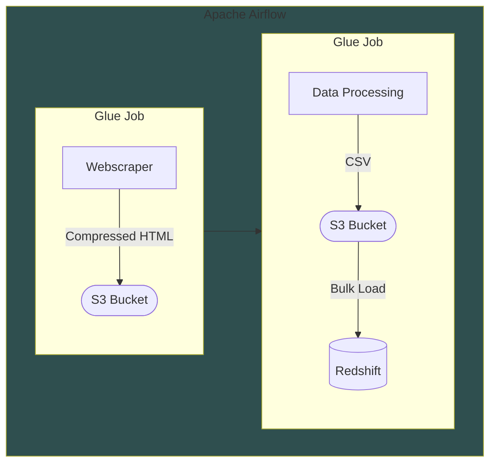

```mermaid
flowchart TD;
    subgraph air["Apache Airflow"]
    subgraph glue1["Glue Job"]
    A["Webscraper"] --> |Compressed HTML| B(["S3 Bucket"]);
    end
    subgraph glue2["Glue Job"]
    C["Data Processing"];
    C --> |CSV| D(["S3 Bucket"]);
    D --> |Bulk Load| E[(Redshift)];
    end
    glue1 --> glue2
    end
    style air fill:darkslategrey;
```
